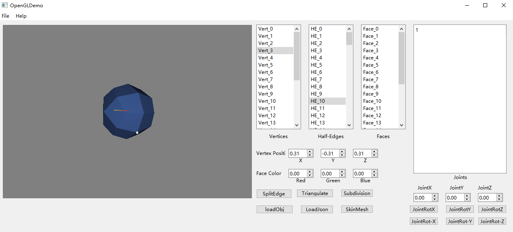
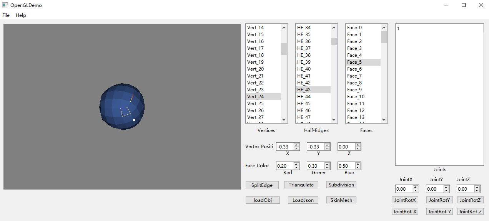
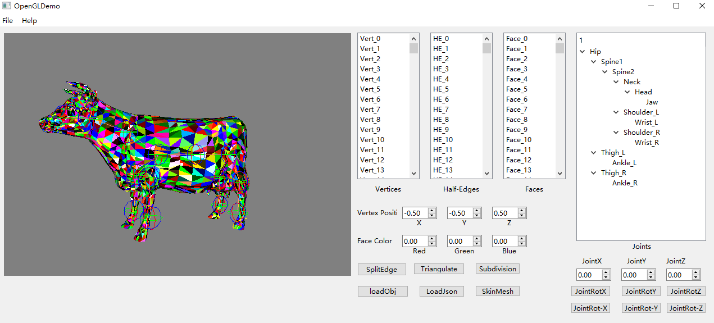
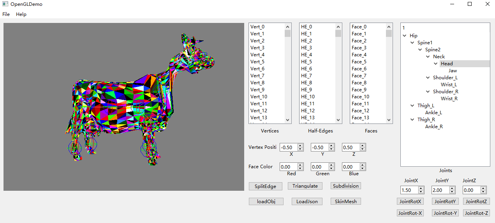

# Mini Maya #

Mini-Maya is a project to recreate some of the mesh editing features in Maya and other similar applications.

The project is developed in Qt and OpenGL. 

It uses half edge data structre as inner mesh data.

Some featuresf this project:

1. Surface Triangulation (using ear-clipping method)
2. Split Edge
3. Mesh Subdivsion
4. Exturde Faces
5. Load obj files
5. Load skeletons from json and bind skeletons

Some screenshots:

